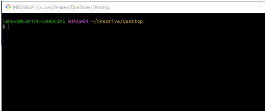
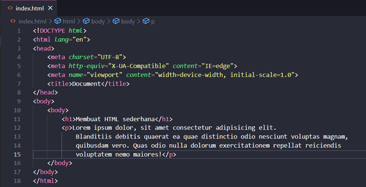
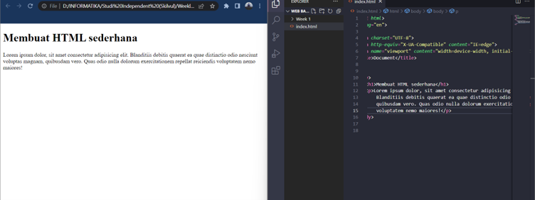
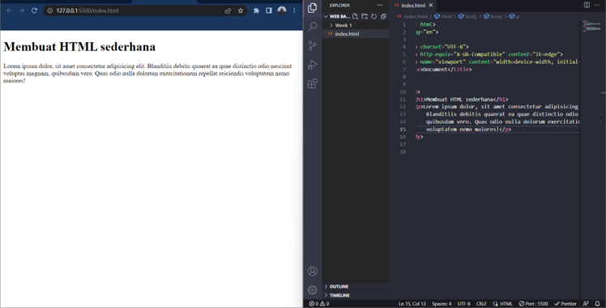
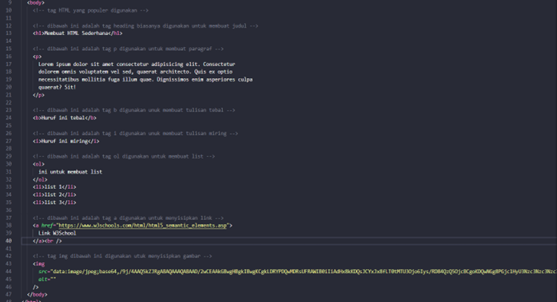
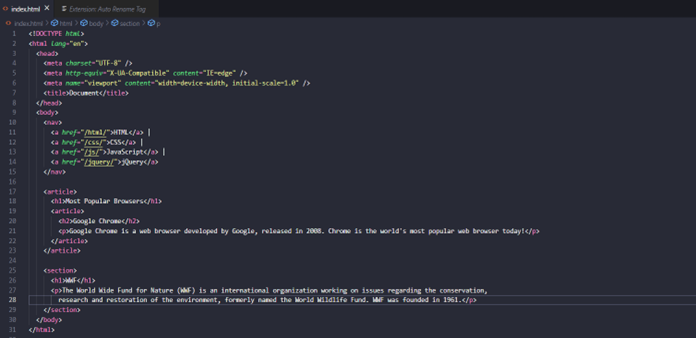
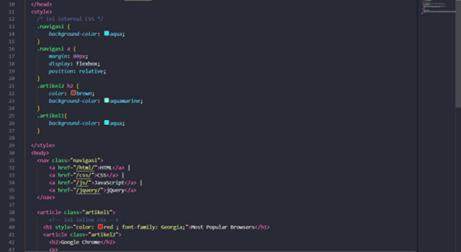
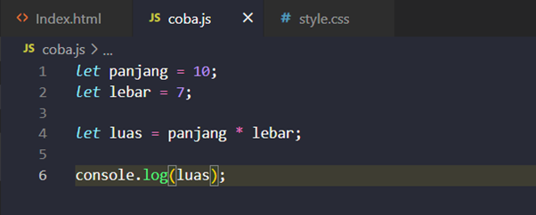

# UNIX

Shell, program yang digunakan untuk berkomunikasi atau memerintah system. Shell ini adalah program yang menerima perintah, kemudian meneruskan perintah tersebut ke system untuk dieksekusi.."command line" atau "command line interface", sebenarnya yang dimaksud adalah shell yang berbasis teks.

    Saat pertama kali membuka terminal, kamu akan dihadapkan dengan tampilan seperti ini. 

    
Ini disebut "shell prompt" dan tampilan ini muncul ketika shell siap menerima input.
Di CLI untuk sistem operasi mirip Unix, default shell yang digunakan biasanya adalah bash. macOS sendiri, sejak macOS Catalina sudah mengganti default shellnya menjadi ZSH. Tapi untuk kursus ini saya akan menggunakan Bash. 
Di Bash, jika karakter terakhir dari promptnya adalah _"hash mark" (#)_, artinya kita punya priviliges superuser.

    Artinya, antara kita login sebagai "root user" atau kita menggunakan terminal emulator yang menyediakan privliges superuser.Cara unix menyusun file-filenya dalam bentuk hierarki atau tree. 

Berikut beberapa command / perintah yang saya peajari di unix :

* Menggunakan command pwd untuk melihat dimana saat ini kita berada
* Menggunakan command ls untuk melihat isi dari directori
* Menggunakan command cd (change directory) untuk berpindah antara direktori
* Untuk melihat isi dari sebuah file misalkan sebuah file.txt dapat            menggunakan cat untuk melihat semua isi file, atau head untuk melihat Sebagian file bagian awal, dan tail untuk melihat bagian akhir dari file. 
*  Untuk membuat direktori kita dapat menggunakan commad _mkdir <nama_direktori>_  dan command _touch <nama_file>_ untuk membuat file.
* Untuk menyalin file kita dapat menggunakan _cp_ dan untuk menyalin direktori dapat menggunakan perintah _cp -R_.

* Untuk memindahkan file dapat menggunakan command mv kemudian untuk rename nama file dapat menggunakan command yang sama yaitu  mv <nama_file_baru>. kemudian untuk memindahkan direktori dapat menggunakan command mv -R, untuk mengubah nama direktori dapat menggunakan command mv <old-folder-name> <new-folder-name>
    
* Untuk menghapus file kita dapat menggunakan command rm dan untuk menghapus direktori dapat menggunakan _rm -D / rm – rf(untuk paksa hapus)_.
  
# Git dan GitHub

Kenapa Git dan Github tools yang wajib digunakan
> Karena git merupakan tools yang sangat berguna bagi developer / programmer biasanya digunakan oleh para programmer sebagai tempat penyimpanan file pemrograman mereka, karena lebih efektifyang dapat melacak setiap perubahan yang terjadi pada suatu folder atau file.dan github merupakan. 

> GitHub adalah platform khusus developer yang dibuat karena terinspirasi dari cara bekerja para programmer. Dengan github developer / programmer dapat berkolaborasi dalam satu tim.

> Git adalah aplikasi yang dapat melacak setiap perubahan yang terjadi pada suatu folder atau file. Sedangkan github adalah penyedia interface grafis berbasis cloud sebagai tempat untuk melakukan seluruh tugas

### Alur kerja dari Git dan GitHub
* git config ( konfigurasi git untuk set up awal)
* git init (mengiinisialisasi folder/directori dan membuat repositori baru yang telah dibuat agar ketika ada perubahan dapat terlacak oleh git).
* menambahkan file baru 
* git add ( menambahkan file yang telah dibuat ke folder yang sudah diinisialisasi dan file statusnya masih untracked files)
* git commit -m ‘ pesan commit’ ( setelah dicommit file yang tadinya untracked akan berubah statusnya  menjadi modified files)
* git status (menampilkan fil yang telah dimodifikasi didirektori kerja) / git log ( menampilkan commit terakhir dicabang branch)

# HTML
HTML digunakan untuk menampilkan konten pada browser.HTML tidak termasuk dalam Bahasa pemrograman, melainkan Hyper Text Language penyusun kerangka website yang sifatnya statis , konten yang dapat ditampilkan seperti Text, Image, Video, Link, dan masih banyak lainnya. Tools yang diperlukan untuk menggunakan HTML ada 2 yaitu web browser ( CHROME ) dan code editor (Visual Studio code dll).

Dalam html teradapat tag utama yaitu tag _head_ dan _body_.

Ada beberapa tag yang digunakan yaitu tag _h1_  Heading (biasanya digunakan sebagai judul dalam sebuah halaman website, heading terdapat 1 sampai 6 tingkatan sub heading. Kemudian tag _p_ digunakan untuk teks paragraph, tag _h1_ dan _p_ terdapat pada bagian body HTML.

    berikut cara mengakses konten HTML melalui live server (port 5500) atau secara manual

Secara manual

Melalui live server

    Berikut contoh kode HTML dengan tag-tag yang populer digunakan

Dibawah ini beberapa tag HTML dan pengertiannya
* Tag h1 : untuk membuat judul.
* Tag p : untuk membuat pargraf. 
* Tag b : untuk membuat tulisan tebal.
* Tag i : untuk membuat tulisan miring.
* Tag ol : untuk membuat list.
* Tag a : untuk menyisipkan link. 
* Tag img : untuk menyisipkan gambar.

__Elemen semantic__ adalah elemen yang dengan jelas menggambarkan artinya bagi browser dan pengembang.contohnya tag nav, tag article, tag section. Berikut tag semantic HTML , elemen semantik dengan jelas menggambarkan artinya bagi browser dan pengembang. contoh elemen semantic: _form , table, dan article_ Jelas mendefinisikan isinya.

Contoh HTML sederhana

Berikut langkah langkah mendeploy file HTML ke Netlify
*Buat file HTML terlebih dahulu di VS code
*   Pastikan file HTML berada disuatu folder
*   Kemudian lakukan inisialisasi _git init_ melalui terminal VS code
*   Lalu lakukan _git add_ pada file tersebut
*   Setelah itu lakukan commit _(git commit -m "pesan")_ 
*   Lalu cek status file dengan _git log_ untuk mengecek status commit terakhir
*   Setelah itu buat repositori pada GitHub (Pastikan anda sudah memiliki akun, jika belum dapat melakukan _sign-up_ terlebih dahulu)
*   Kemudian koneksikan folder yang sudah dicommit dengan repositori Github dengan perintah _git remote add origin (link repository)_
*   Setelah terkoneksi lakukan percabangan dengan _git branch -M_ main
*   Lalu lakukan _git push -u origin main_ untuk menambahkan file ke repository
  

# CSS (Cassading Style Sheets)
Peran CSS pada web development 
Dengan CSS, kita bisa mengubah warna, menggunakan font custom, editing text format, mengatur tata letak, dan lainnya.
Beberapa jenis penggunaan CSS diantara lain adalah
* Inline style : CSS yang ditulis langsung di dalam tag HTML-nya di tag pembuka. Inline style akan di eksekusi terlebih dahulu Ketika ada style yang sama
* Internal style : CSS ini berapa langsung di dalam file HTML-nya, tepatnya di dalam tag head dan diapit dengan tag style.
* Eksternal style : CSS ini adalah jenis CSS yang penulisan codenya secara terpisah dan beresktensi .css untuk nama filenya.

Berikut beberapa styling dalam css
*   Background-collor : mengubah warna background 
*   Color :memberikan warna pada text 
*   Padding : jarak antara konten dengan elemen 
*   Margin : mengatur jarak element 1 dengan element lainya 
*   Border radius : untuk membuat suatu element memiliki tepian yang elips atau umumnya disebut sudut lengkungan. 
*   Border : membuat garis tepi 
*   Font-family : mengubah/menambahkan jenis font\

CSS Flexbox
terdapat dua komponen utama sebuah layout Flexbox yaitu __container__ dan __item__. Untuk membuat CSS flexbox sangat sederhana dan mudah untuk diterapkan, dengan memberikan style display: flex; pada container, Anda sudah berhasil membuat CSS flexbox. Dengan properti flex-direction Anda bisa menggunakannya untuk menentukan arah (direction) untuk item-item yang berada didalam container flexbox. Flex-direction mempengaruhi arah sumbu utama (_main axis_) dan sumbu silang (_cross axis_).
Secara default flex-direction bernilai row, ini artinya arah sumbu mengarah secara __horizontal__.

# Algoritma dan Struktur Data

Perbedaan antara Algoritma dan Data Structures
    
    Algoritma adalah deskripsi berupa step-step yang dibutuhkan untuk menyelesaikan suatu masalah. 

    Sedangkan Data struktur digunakan untuk mengelola/manajemen sebuah data - Dan Algoritma yang akan menyelesaikan suatu permasalahan menggunakan data tersebut.

>Manfaat dari algoritma dan data structure Algoritma di sini bermanfaat untuk membantu berpikir secara sistematis dan terstrukur untuk menyelesaikan masalah. Membuang hal-hal yang tidak diperlukan dan fokus untuk mencari solusi dari permasalahan yang saya hadapi.

    Algoritma menghitung luas Persegi Panjang
    1. Mulai
    2. Masukan panjang
    3. Masukkan lebar
    4. Proses, L = panjang ** lebar
    5. Menampilkan luas persegi panjang
    6. selesai

Menerapkan algoritma ke dalam bahasa pemrograman _JavaScript_ ( mempraktikkan pendekatan menyelesaikan suatu masalah untuk diselesaikan melalui program).

# JavaScript dasar
>Peran JavaScript pada web development
Javascript digunakan untuk logic program pada sebuah website, Javascript juga dapat membuat website menjadi interaktif dan dinamis.JavaScript umumnya dapat dijalankan melalui browser pada device user, dan saat ini browser chrome dan mozilla yang dapat menjalankan  fitur javascript

Ada 5 tipe data dalam javascript
1.	__Number__ adalah tipe data yang berisi semua angka termasuk bilangan decimal
2.	__String__ merupakan tipe data yang berisi grub karakter mulai dari _huruf, spasi. Symbol , dll_. Dalam penulisannya diawali dan diakhiri dengan _single quotes (‘) atau double quotes(“)_.
3.	Tipe data __boolean__ adalah tipe data yang hanya mempunyai 2 buah nilai yaitu _TRUE (benar) or FALSE (salah)_.
4.	__Null__ dapat diartikan sebagai variable/data yang _tidak memiliki nilai_.
5.	__Undefined__ adalah tipe data yang tidak merepresentasikan _varible/ data yang tidak ada nilainya_. Dalam artian lain memang tidak terdefinisi
6.	Tipe data __object__ adalah koleksi data yang saling berhubungan (related). Tipe data object _dapat menyimpan data dengan tipe data apapun (number, string, boolean, dan lainnya)_.

Jenis-jenis operatordalam javascript
-    Assignment operator digunakan untuk menyimpan sebuah nilai pada variabel.
-    Mathematical Assignment Operator
-    increment atau decrement untuk menambah atau mengurangi sebesar 1 nilai.
-    Arithmetic operator adalah operator yang melibatkan operasi matematika. Contoh : __Tambah (+),Kuramg (-),Perkalian (*),Pembagian (/),Modulus (%)__
-    Comparison operator adalah operator yang membandingkan satu nilai dengan nilai lainnya.
-    Logical operator biasa digunakan untuk sebuah CONDITIONAL pada pemograman. Menghasilkan __nilai BOOLEAN yaitu TRUE or FALSE__.

> Membedakan control flow (conditional dan looping)
>* Conditional merupakan statement percabangan yang menggambarkan suatu kondisi. Program akan mengecek kondisi spesifik dan menjalankan perintah berdasarkan kondisi tersebut. ang dicek adalah apakah kondisi tersebut TRUE (benar).Jika TRUE maka code didalam kondisi tersebut dijalankan. Contohnya IF, IF ELSE, ELSE IF

>* Looping adalah statement yang mengulang sebuah instruksi hingga kondisi terpenuhi atau jika kondisi stop/berhenti tercapai. Contohnya FOR LOOP (FOR LOOP digunakan jika kita tahu seberapa banyak nilai pasti untuk pengulangannya), WHILE LOOP (WHILE LOOP digunakan jika kita tidak mengetahui jumlah pasti pengulangan.), dan yang terakhir DO WHILE (Dengan menjalankan pengulangan 1 kali sebelum dilakukan pengecekan kondisi).

# SEKIAN DAN TERIMA KASIH
# Diego Alfiandro

_src : Dyalfya_

