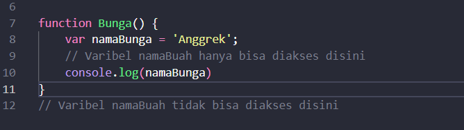

Weekly report

# HTML DOM dan JavaScript

## JavaScript Scope dan Function
Scope dalam JS merupakan sebuah konsep dalam flow data variable, scope ini menentukan suatu variabel bisa diakses pada scope tertentu atau tidak. Sebelum membahas mengenai Scope global dan local , yang pertama harus dipahami adalah blocks, __Blocks adalah code yang berada didalam curly braces {}__ , contohnya adalah sebuah function, conditional , dan looping. Kemudian macam macam scope ada 2 yaitu
    
    Global scope berarti variabel yang kita buat dapat diakses dimanapun dalam suatu file.Agar menjadi Global Scope, suatu variabel harus dideklarasikan diluar Blocks.

 

    Local scope sebuah variable yang dideklarasikan didalam blocks seperti function, conditional, dan looping. Maka variabel hanya bisa diakses didalam blocks saja. Tidak bisa diakses diluar blocks.

>Function adalah sebuah blok kode dalam sebuah grup untuk menyelesaikan 1 task/1 fitur, dan nantinya fitur yang telah kita buat dapat kita gunakan Kembali. 

    Function dapat dipanggil dengan cara FunctionName(). 

Didalam sebuah function terdapat
 _argument dan parameter_ , parameter disini berfungsi agar function dapat menerima sebuah inputan data  dan mengetahui dat yang dibutuhkan agar dapat digunakan untuk menyelesaikan sebuah taks. Dan argument adalah nilai yang digunakan saat function itu dipanggil (catatan : jumlah argument harus sama dengan jumlah parameternya). 

 

Kemudian jenis jenis function dalam Javascript :
* Arrow Function ==> _function MyFunction = () => {}_
* Another Function ==> _let MyFunction (){}_ dan _const MyFunction(){}_

## Data type in JavaScript
Disini saya belajar mengenai tipe tipe data dalam JavaScript, 

    JavaScript adalah bahasa dinamis dengan tipe dinamis . Variabel dalam JavaScript tidak secara langsung terkait dengan jenis nilai tertentu, dan variabel apa pun dapat diberi (dan ditetapkan ulang) nilai dari semua jenis. 

Didalam JS tipe data dibagi menjadi 2 yaitu
### 1.	Tipe data primitive
Semua jenis kecuali objek mendefinisikan nilai yang tidak dapat diubah. Di JavaScript ada tujuh tipe data primitif yang bisa kita gunakan yakni 
*  String, adalah tipe data yang tidak dapat dijumlahkan, umumnya berisi kata atau kalimat, namun bisa juga sebuah angka akan tetapi tidak dapat di jumlahkan dengan tipe data number.
* Number, JavaScript menggunakan format IEEE-754 untuk merepresentasikan dua buah nilai integer dan floating-point (pecahan).
*  BigInt, Tipe BigInt adalah primitif numerik dalam JavaScript yang dapat mewakili bilangan bulat dengan presisi arbitrer. Dengan BigInts, Anda dapat dengan aman menyimpan dan mengoperasikan bilangan bulat besar bahkan di luar batas bilangan bulat aman untuk Numbers.
*  BigInt dibuat dengan menambahkan nke akhir bilangan bulat atau dengan memanggil konstruktor.
*  Boolean, Tipe data bolean biasa digunakan untuk merepresentasikan entitas logika, dan hanya memiliki 2 nilai yaitu True (benar) dan False (salah).
*  Undefined, adalah tipe data spesial yang hanya memiliki nilai undefined. Undefined bisa tercipta pada suatu variable yang tidak memiliki nilai, dimana variable sudah dideklarasi namun tidak ada nilai didalamnya atau tidak di inisialisasi.
*  NaN , Tipe data NaN (Not a Number) digunakan untuk merepresentasikan sebuah kesalahan dalam penghitungan, kesalahan tersebut terjadi karna perbedaan tipe data, misalnya saja string dengan number
*  Null, Null adalah tipe data, null juga sebuah nilai, tipe data null hanya bernilai null meskipun nilai null bisa dikatakan tidak memiliki nilai. dan 
*  Symbol, Tipe data symbol bisa dikatakan tipe data baru setelah hadirnya ECMAScript 6 (ES6).Di kutip dari _Mozilla.org_ tipe data simbol digunakan sebagai pengenal properti objek.

### 2.	Tipe data non-primitive
*  Array,  adalah tipe data yang unik, array dapat menampung berbagai tipe data didalamnya, sehingga sangat efesien pada beberapa kasus agar dapat lebih mudah dikelola. Array dapat menampung number dan string, anda juga dapat mencoba dengan menggunakan tipe data lainnya. 
  
*  Object, Tipe data objek umumnya memiliki kumpulan properti, dimana didalam properti tersebut didefisinikan dengan pasangan Key (kunci) dan Value (Nilai). Tipe data object biasa digunakan untuk mengirim data dan menampilkannya ke browser sebagai sebuah data yang utuh. Penggunaan tipe data object biasanya digunakan pada kirim dan terima melalui API backend.

            JavaScript juga termasuk dalam salah satu bahasa dengan weakly type yang berarti memungkinkan konversi tipe implisit saat operasi melibatkan tipe yang tidak cocok, JS dapat menampilkan hasil operasi dari tipe data String dengan Number yang menghasilkan data String bukan mengembalikan nilai error karena perbedaan tipe data. Untuk simbol dan BigInts , JavaScript sengaja melarang konversi tipe implisit tertentu.

## JavaScript dan HTML DOM

JavaScript dan DOM, DOM disini tidak termasuk dalam bagian dari JavaScript dan DOM ini merupakan sebuah web API untuk membangun website. 

    DOM merupakan singkatan dari Document Object Model.Artinya, dokumen (HTML) yang dimodelkan dalam sebuah objek.Objek dari dokumen ini menyediakan sekumpulan fungsi dan atribut/data yang bisa kita manfaatkan dalam membuat program Javascript. Inilah yang disebut API (Application Programming Interface).

Objek DOM di javascript bernama document. Objek ini berisi segala hal yang kita butuhkan untuk memanipulasi HTML. Objek document adalah model dari dokumen HTML. Objek ini berisi kumpulan fungsi dan atribut berupa objek dari elemen HTML yang bisa digambarkan dalam bentuk pohon. 

Struktur pohon ini akan memudahkan kita dalam menggunakan elemen tertentu. Ada 2 cara dalam mengakses DOM yaitu melalui elemet dan node.
Apabila kita ingin mengakses elemen yang spesifik, terdapat beberapa fungsi yang bisa digunakan:
*  getElementById() fungsi untuk memilih elemen berdasarkan atribut id.
*  getElementByName() fungsi untuk memilih elemen berdasarkan atribut name.
*  getElementByClassName() fungsi untuk memilih elemen berdasarkan atribut class.
*  getElementByTagName() fungsi untuk memilih elemen berdasarkan nama tag.
*  getElementByTagNameNS() fungsi untuk memilih elemen berdasarkan nama tag.
*  querySelector() fungsi untuk memilih elemen berdasarkan query.
*  querySelectorAll() fungsi untuk memilih elemen berdasarkan query.

contoh mengakses HTML DOM dengan _getElementById()_

## Manipulasi DOM

DOM(Document Object Model) adalah model data standar. 

    DOM adalah cara javascript melihat suatu halaman html. DOM adalah sebuah platform dan interface yang memperbolehkan pengaksesan dan perubahan pada konten, struktur, dan style pada sebuah dokumen oleh program dan  script. 

Istilah HTML DOM mengacu kepada dokumen html. Kasusnya disini ialah konten, struktur, dan style pada dokumen html dapat diakses dan dirubah dengan menggunakan sintaks javascript.

    Pada model DOM ini, setiap elemen html dipandang sebagai sebuah object. Setiap object bisa terdiri dari object-object lain, 

sama halnya dengan dokumen html yang terdiri dari elemen root (elemen _html_ ), elemen root terdiri dari elemen _head_ dan elemen _body_, elemen _body_ boleh jadi terdiri dari elemen _a_, _h1_, _p_, dst. 

Elemen-elemen pada dokumen html membentuk sebuah object document yang merupakan object dari dokumen html itu sendiri
	Yang dapat Javascript lakukan dengan HTML DOM?
*  Javascript dapat merubah setiap elemen HTML pada halaman web.
*  Javascript dapat merubah setiap atribut HTML pada halaman web.
*  Javascript dapat merubah setiap style CSS pada halaman web.
*  Javascript dapat menghilangkan elemen dan atribut HTML yang ada.
*  Javascript dapat menambahkan elemen dan atribut HTML baru.
*  Javascript dapat bereaksi pada setiap event yang ada pada halaman web.
*  Javascript dapat membuat event baru pada halaman web.

contohnya merubah _background color_ pada halaman web

## DOM event
Event secara bahasa artinya kejadian.

    Pada Javascript,event adalah kejadian atau interaksi yang terjadi di halaman web.Kejadian yang dimaksud di sini seperti aktivitas yang dikerjakan pada halaman web.

Misalnya seperti:
*  User melakukan scroll;
*  User melakukan klik pada elemen tertentu;
*  Halaman web di-load;
*  Form di-submit;
*  dan sebagainya.

Kita bisa melakukan aksi tertentu untuk merespon event tersebut. Misalnya: Saat elemen _button_ diklik, kita bisa jalankan fungsi untuk melakukan sesuatu. Ada 3 cara dalam menggunakan event dalam JavaScript yaitu
*  HTML attribute
*  Event property
*  Dan sebuah method addEventListener()

Contoh DOM event

#### Diego Alfiandro
##### _dyAlfya_