# Weekly Report (week 3)

## Array Multidimensional

    Multidimensional Array bisa dianalogikan dengan ada array didalam array. Array sendiri merupakan sebuah tipe data yang dapat menyimpan banyak data sekaligus, array dapat menyimpan banyak jenis data ( string, number, Boolean, object , dan array itu sendiri).
* Cara pendeklarasian Array
  
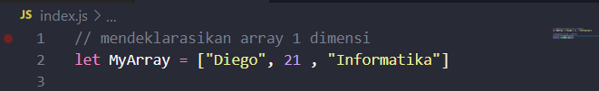


* Cara mengakses Array<br>
  karena array menggunakan sistem indexing, maka ketika mengakses array kita membutuhkan index nya seperti contoh dibawah ini. Dijavascript indexing array dimulai dari 0 dan seterusnya sesuai banyaknya data dalam array

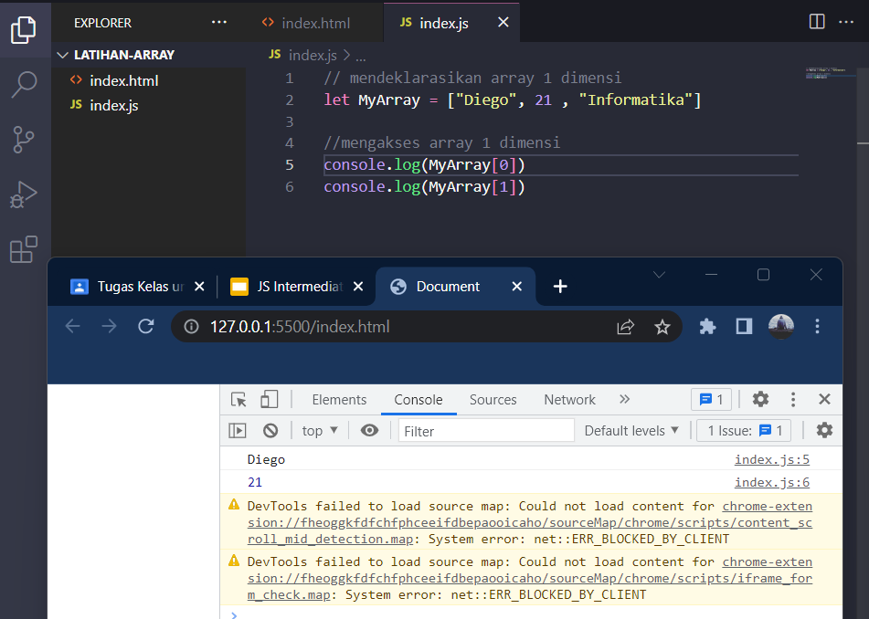

    Untuk array multidimensi cara mendeklarasikannya tidak jauh berbeda dengan array 1 dimensi.

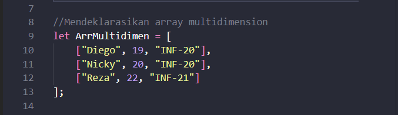

    cara mengakses array multidimensional dapat menggunakan cara berikut :

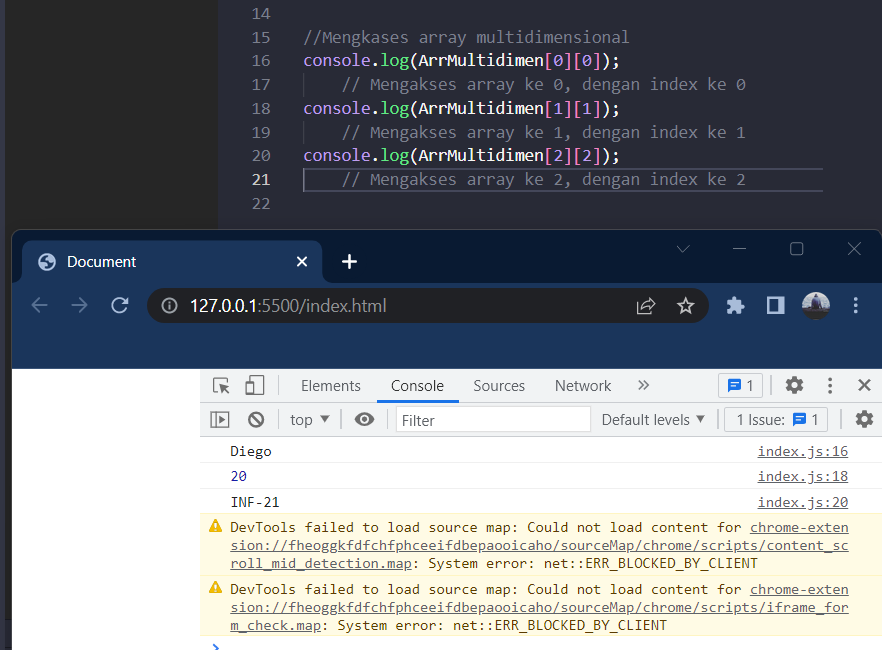

    Array multidimensional juga dapat menggunakan properti lenght yang menghitung banyaknya data dalam array / panjang array.

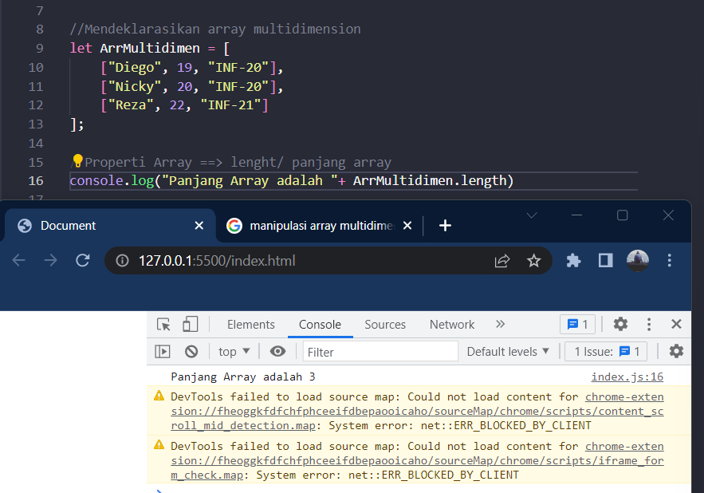

    Array multidimensional juga dapat menggunakan method seperti push(), pop (), unshift () , shift() dll..
    contohnya seperti dibawah ini :

* Method push()

 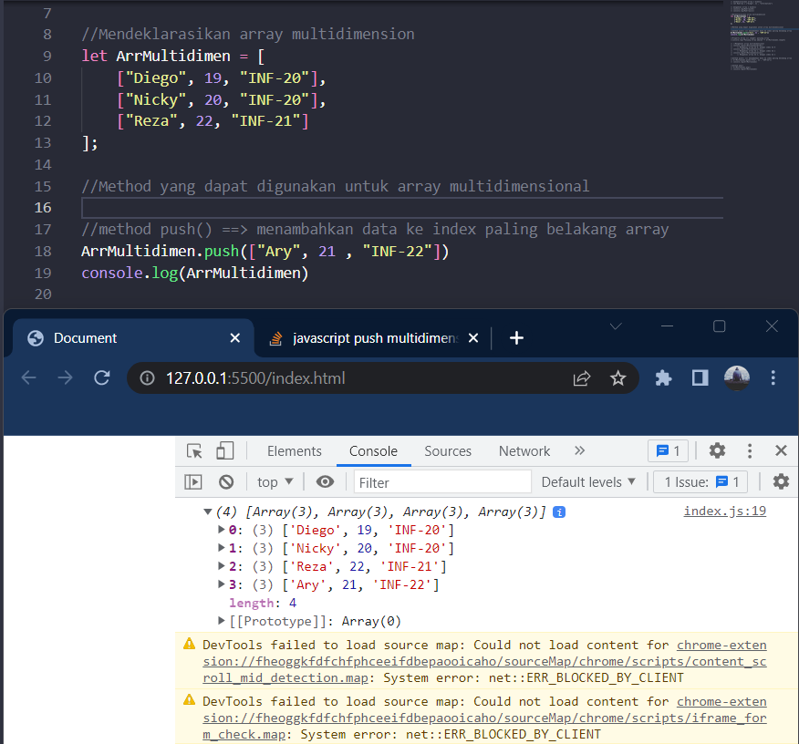

* Method pop()

 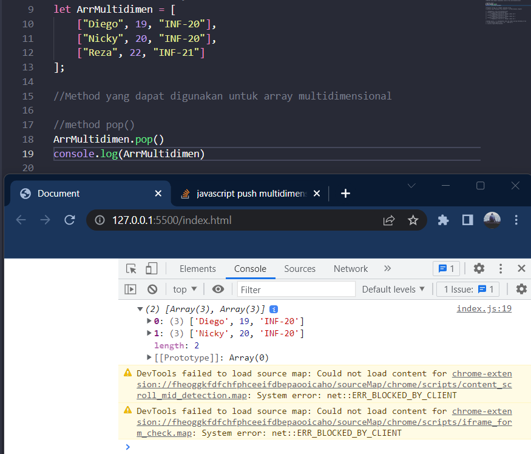


        Looping array menggunakan FOR / FOR OF untuk menampilkan data aray

* Menggunakan FOR

 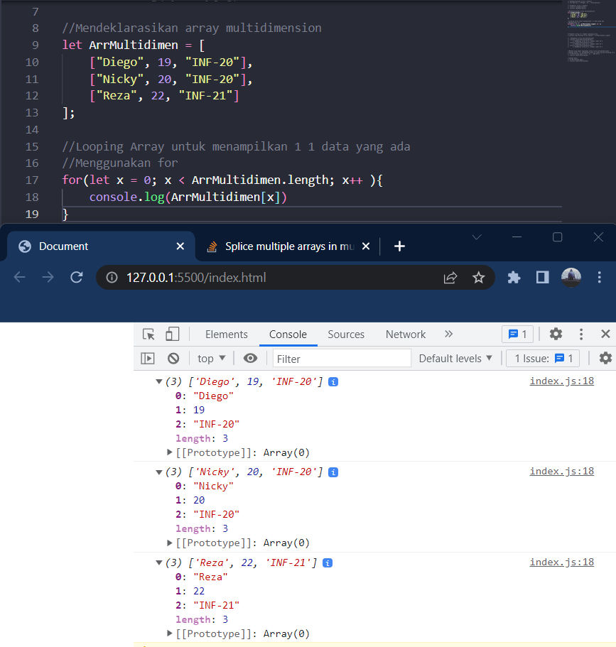

  
* Menggunakan FOR-EACH

 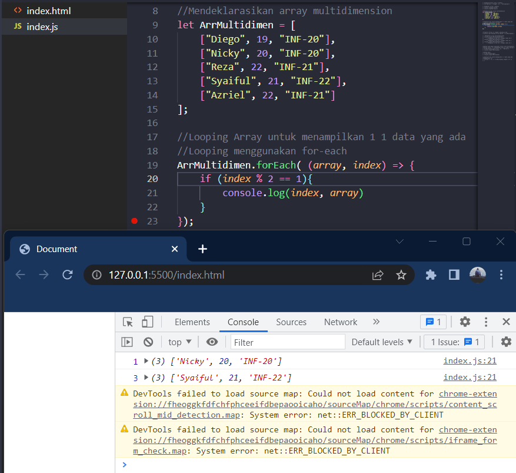


* Menggunakan MAP

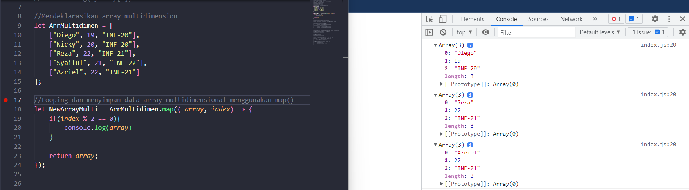


## Object

    Object adalah sebuah tipe data pada variabel yang menyimpan properti dan fungsi (method), 
        -Properti dalam sebuah object adalah data lengkap dari sebuah object. 
        -Sedangkan method adalah action dari sebuah object. Apa saja yang dapat dilakukan dari suatu object. 
    Object dapat diassign kedalam sebuah variable, didalam object kita dapat menyimpan properti dengan tipe data apapun.

* Cara mendeklarasikan object
  
  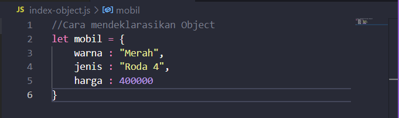

* Cara mengakses object
    *  dot notation
  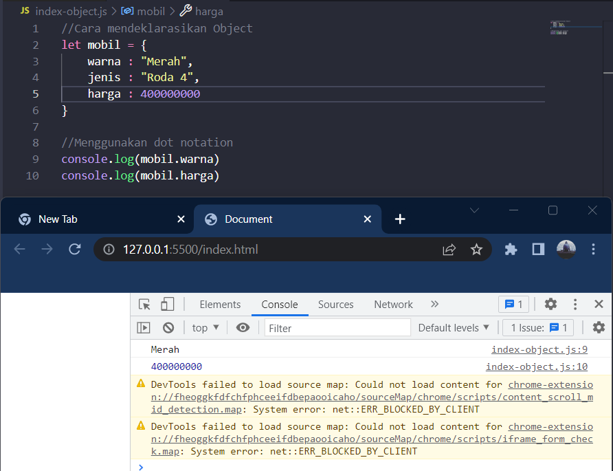

    * bracket notation
  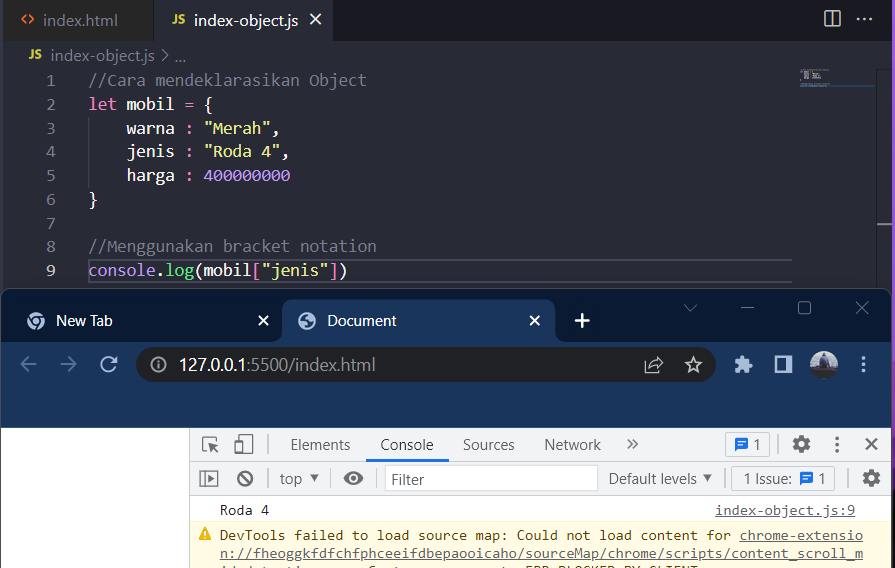

Kita dapat melakukan update pada variabel dengan tipe data Object.
* Object dapat mengupdate value dari key yang sudah tersedia.
* Object dapat menambahkan key dan value baru.
* Variable object yang dapat diupdate harus dideklarasikan menggunakan let

Berikut cara mengupdate object

 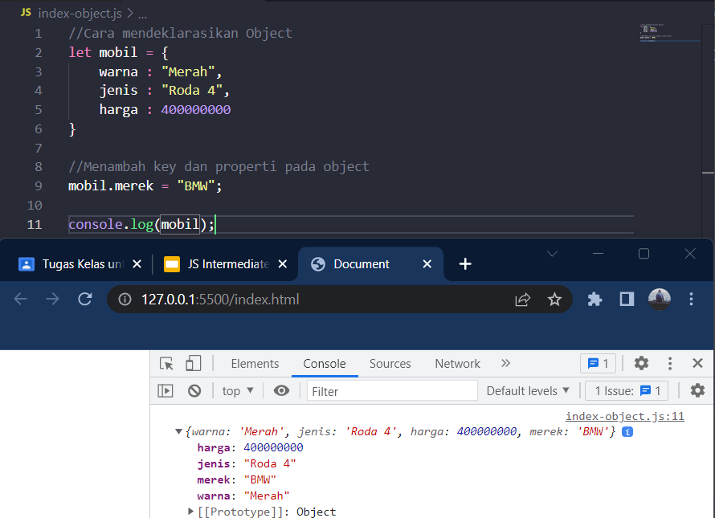

Berikut cara menghapus property object

 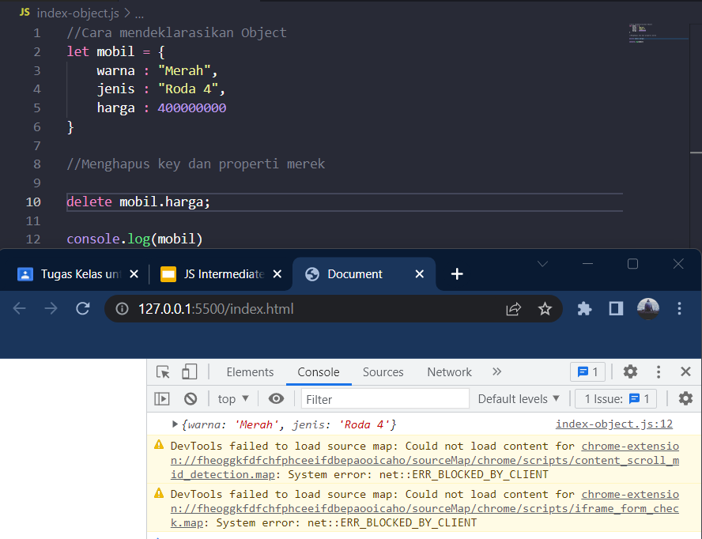


Salah satu method object adalah konversi properti object menjadi sebu9ah array,sebagai berikut :
 
 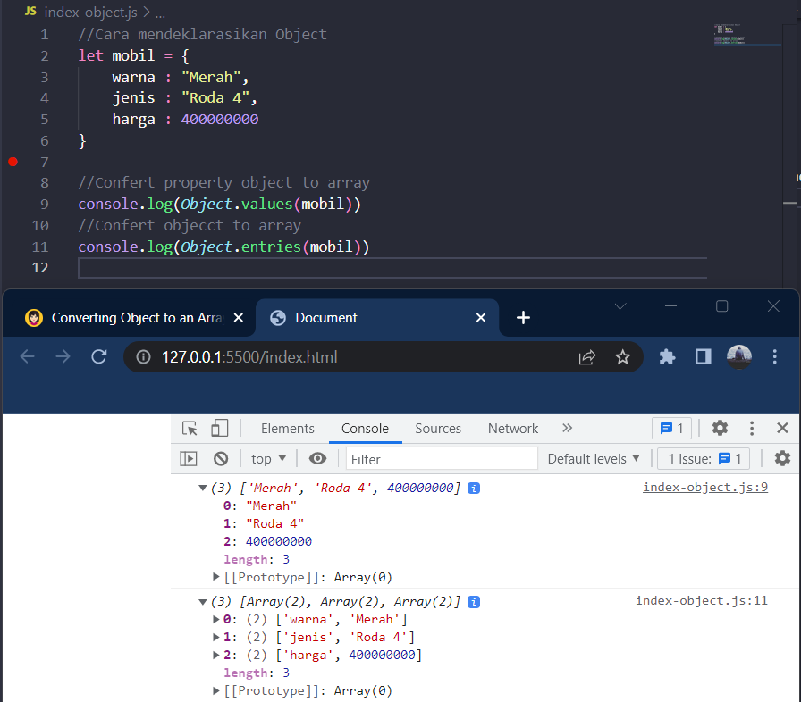

    Nested Object adalah sebuah object yang berada didalam object contohnya dibawah ini

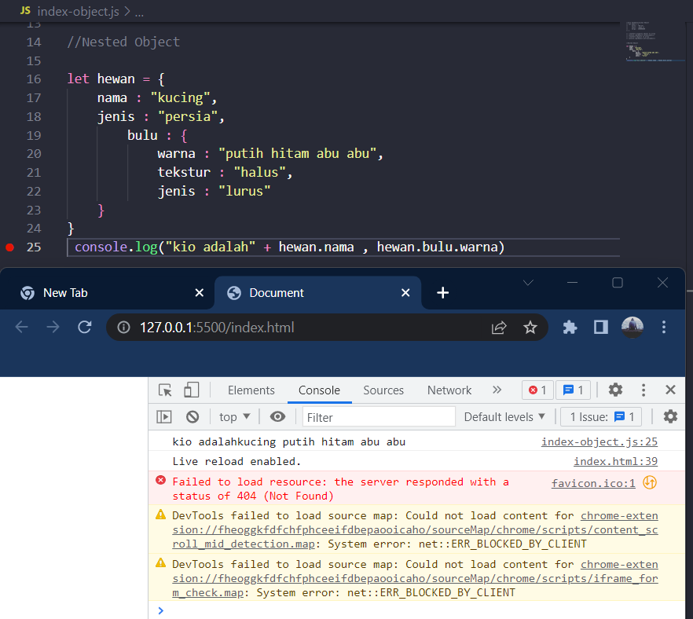

    Looping dan array of object, karena object sama dengan array yang dapat menyimpan banyak data, kita dapat menggunakan array of object untuk lebih dari 1 data

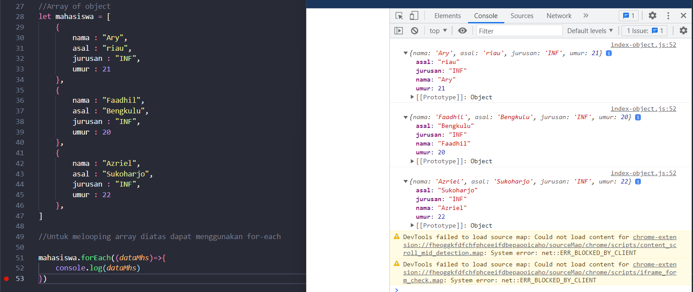


## Rekursive Function dan Modules

    rekursive function adalah sebuah function yang memanggil dirinya sendiri sampai kondisi tertentu. Recursive kebanyakan digunakan untuk case matematika, fisika, kimia, dan yang berhubungan dengan calculation. Recursive akan berhenti memanggil dirinya sendiri jika kondisi terpenuhi.

* Struktur fungsi rekursif sebagai berikut
  
  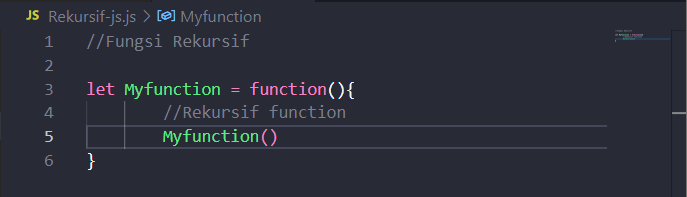

* Algoritma fungsi rekursif

  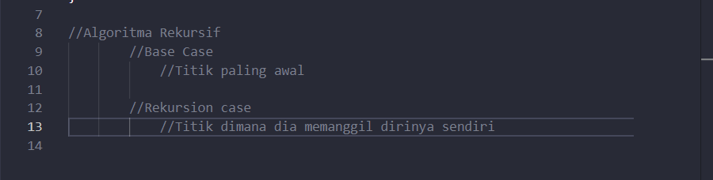

* Fungsi rekursif selalu memiliki kondisi yang menyatakan kapan fungsi tersebut berhenti. Kondisi ini harus dapat dibuktikan akan tercapai, karena jika tidak tercapai maka kita tidak dapat membuktikan bahwa fungsi akan berhenti, yang berarti algoritma kita tidak benar.
  
* Fungsi rekursif selalu memanggil dirinya sendiri sambil mengurangi atau memecahkan data masukan setiap panggilannya. Hal ini penting diingat, karena tujuan utama dari rekursif ialah memecahkan masalah dengan mengurangi masalah tersebut menjadi masalah-masalah kecil.

Contoh fungsi rekursi menghitung faktorial bilangan

  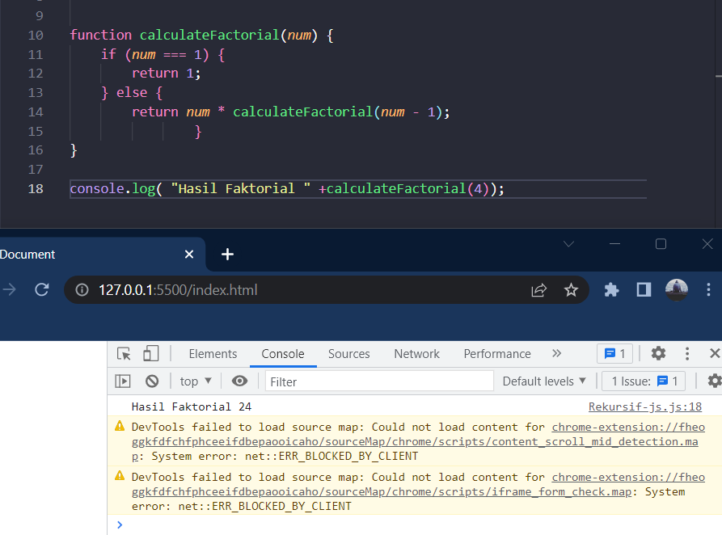


      Modules adalah cara untuk memisahkan kode ke file yang berbeda. Keuntungan dari modules yaitu mudah untuk mengelola kode serta kode tidak menumpuk di dalam satu file. Terdapat 2 kata kunci pada modules yaitu export dan import.

```Javascript
  // File hewan-buah.js
  export let hewan = ["kucing", "kuda", "kelinci", "koala"]
  let buah = ["mangga", "jambu", "pisang", "durian"]
  export default buah
  export function sayHello() {
   console.log("hallooo")
  }

  // File module.js
  import {motor} from "./hewan.js"
   console.log(hewan);
  import buah, { hewan as hewanKu, sayHello  } from "./hewan-buah.js"
  console.log(buah);
  

  Berdasarkan script diatas,
  - file module.js hanya bisa import, karena dia file utama.
  - file hewan-buah.js bisa melakukan import dan export.
  ```

## Asyncronous 
    Proses yang dilakukan secara tidak berurutan. Jika proses terlalu panjang, akan disela oleh proses yang lebih singkat

### Blocking

Proses yang gabisa diselat

- Proses concurrent yg tidak sama dengan multitask/multithread
- Secara umum, bahasa pemrograman berjalan secara synchronous.
- JS memiliki kelebihan dapat menjalankan sebuah proses tanpa harus berurutan.
- Tiap engine JS terdiri dari 2 bagian, heap dan stack. Bersifat first in last out.

### **JS Asynchronous memiliki 3 kunci utama**

  1. Callback
   Callback : function yg dijadikan sebagai argumen
   Ketika sesuatu memerlukan waktu yang lama, maka dia akan masuk kedalam callback queue lalu menjalankan proses yang berada di belakangnya. Jika proses yg belakang sudah selesai, maka engine akan memeriksa yang ada didalam callback queue untuk dijalankan.
   <br>

Contoh:


Output :
yang dikerjakan console.log(“C”) terlebih dahulu karena console.log(“B”) memerlukan waktu sebelum diproses 


   2. Promises
Kejadian yang telah selesai atau gagal dalam operasi asynchronous yang menghasilkan nilai
Saat on progress progress dalam fase pending. Jika gagal maka status asynchronous menjadi rejected. Jika kejadian dari event asynchronous telah berhasil, maka status fulfilled.

* ketika promise terpenuhi

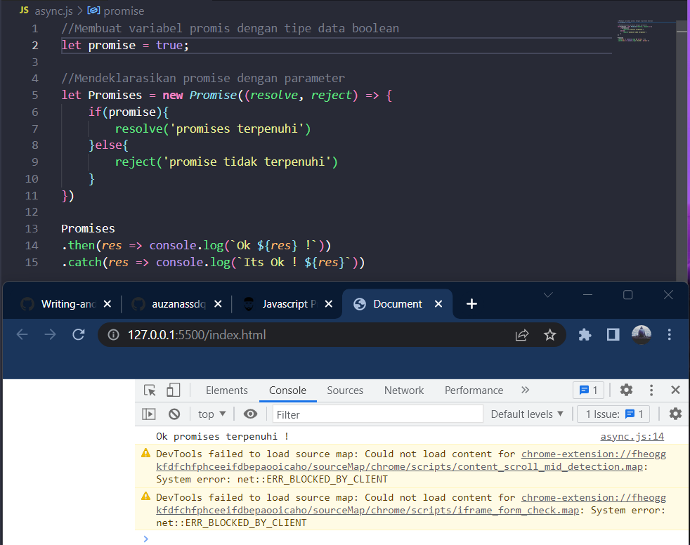

* ketika promise tidak terpenuhi

.png)

  3. Async await


## Web Storage

        Apa yang dimaksud web storage? Web storage adalah salah satu Web API yang dapat menyimpan data secara lokal pada sisi client. Berbeda dengan objek atau array, data yang disimpan pada objek atau array JavaScript bersifat sementara, dan akan hilang jika terjadi reload atau pergantian URL pada browser.

Ada beberapa cara untuk menyimpan data pengguna seperti pencarian, artikel berita, dan lain-lain ke lokal (browser) menggunakan web storage seperti cookies, local storage, dan session storage. Data ini dimanfaatkan oleh situs web tersebut untuk merekam kebiasaan pengguna agar dapat memberikan rekomendasi sesuai preferensi si pengguna tersebut.

### Cookie
cookie dapat menyimpan hingga 4096 byte data (ini termasuk nama, nilai, domain, tanggal kedaluwarsa, dan apa pun yang Anda muat di sana). Anda dapat menambahkan cookie dalam jumlah terbatas per domain yang berubah tergantung pada browser Anda.

### Local Storage & Session Storage

- Pernahkah kita saat melakukan pencarian pada sebuah situs lalu situs tersebut menampilkan riwayat pencarian kita? Iya, data pencarian tersebut disimpan ke dalam local storage untuk diolah menjadi riwayat pencarian. Itulah salah satu contoh penerapan dari local storage pada aplikasi web.
- Berbeda dengan local storage, walaupun masuk ke dalam web storage, data yang tersimpan pada session storage akan hilang ketika session dari sebuah laman berakhir.
- Karakteristik Local Storage:
  1. Menyimpan data tanpa tanggal kadaluarsa.
  2. Data tidak akan dihapus ketika web browser ditutup dan akan tersedia seterusnya selama kita tidak menghapus data local storage pada web browser.
  3. Dapat menyimpan data hingga 5MB.
  4. Hanya dapat menyimpan data string.
- Sedangkan Karakteristik Session Storage:
  1. Data yang disimpan pada session storage akan terus tersimpan selama browser terbuka dan tidak hilang jika laman di-reload.
  2. Membuka banyak tab/window dengan URL yang sama, akan menciptakan session storage yang berbeda di masing-masing tab/window.
  3. Menutup tab/window akan mengakhiri session dan menghapus data yang tersimpan di session storage pada tab/window tersebut.
  4. Data yang tersimpan dalam session storage harus berbentuk string.
  5. Hanya dapat menyimpan data sebanyak 5MB.

### Mengakses Local Storage & Session Storage

1. Local Storage

- Menyimpan Data
  Untuk menyimpan data pada local storage, kita menggunakan method `setItem()` yang membutuhkan 2 parameter. Parameter pertama adalah key yang ingin kita simpan dan parameter kedua adalah data (value) dari key yang akan disimpan.
  ```javascript
  let key = 'item1';
  localStorage.setItem(key, 'value');
  ```
- Mengambil Data
  Untuk mengambil data yang telah tersimpan pada local storage, kita dapat menggunakan method `getItem()` yang membutuhkan 1 parameter. Parameter tersebut adalah key dari data yang kita inginkan.
  ```javascript 
  let myItem = localStorage.getItem(key); 
  ```
- Menghapus Data
  Untuk menghapus data yang telah tersimpan pada local storage, kita dapat menggunakan method `removeItem()` yang membutuhkan 1 parameter. Parameter tersebut adalah key dari data yang ingin kita hapus.

  ```javascript
  // menghapus key tertentu
  localStorage.removeItem(key);
  // menghapus semua key
  localStorage.clear();
  ```

2. Session Storage

- Menyimpan Data
  Sama dengan local storage, sintaks untuk menyimpan data pada session storage adalah sebagai berikut:
  ```javascript
  // menambah session storage
  sessionStorage.setItem('key', value);
  ```
- Mengambil Data
  Sama seperti local storage, cara mendapatkan data dari session storage juga menggunakan `getItem(),` seperti berikut ini:
  ```javascript
  // mendapatkan session storage
  sessionStorage.getItem('key');
  ```
- Menghapus Data
  Syntax untuk menghapus data dari session storage ada 2, yaitu:

  ```javascript
  // menghapus session storage satu persatu berdasarkan key
  sessionStorage.removeItem('key');
  // menghapus seluruh session storage sekaligus
  sessionStorage.clear();
  ```


# Terimakasih

### Diego Alfiandro