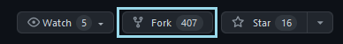
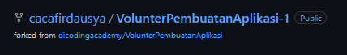
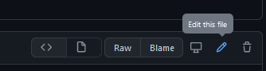
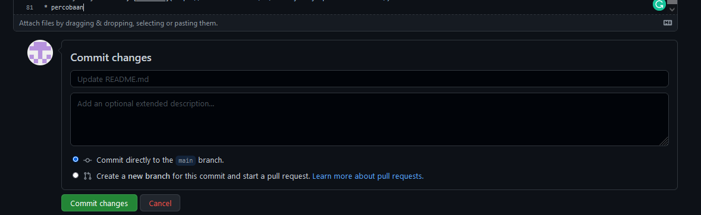
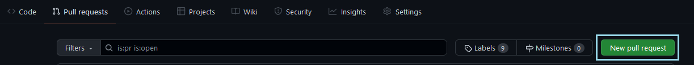
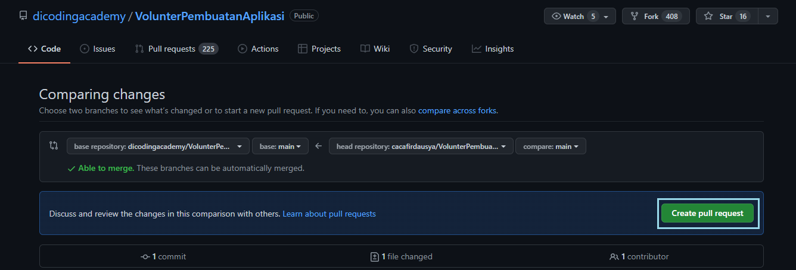
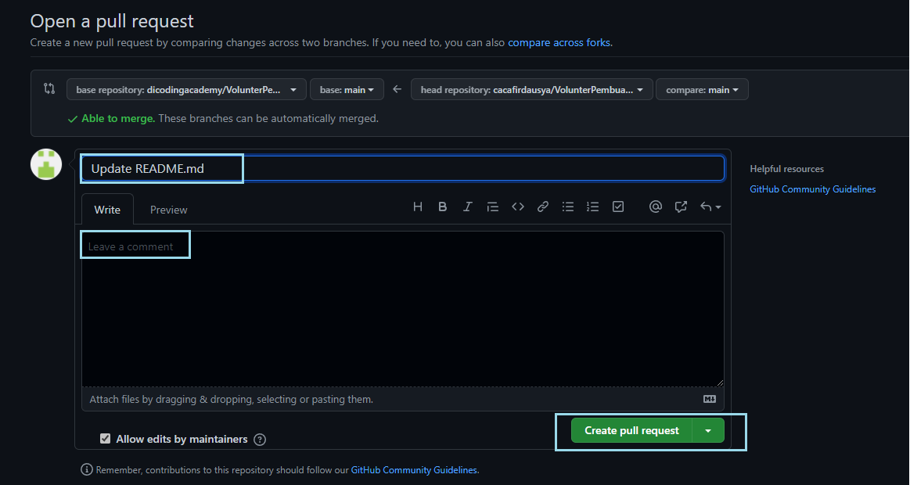

# Laporan writing Week 4

## Javascript Fetch dan Async Await
## Async Await
    Async key memberi Anda cara yang lebih sederhana untuk bekerja dengan kode berbasis promise async. Menambahkan asyncdi awal fungsi menjadikannya fungsi async:

* Contoh
```javascript
<html> <p id="demo"> </html>


<script>
    async function myDisplay() {
        let myPromise = new Promise(function(resolve, reject) {
            resolve("I love You !!");
        });
        document.getElementById("demo").innerHTML = await myPromise;
    }

    myDisplay();
</script>

//hasilnya 
I love You !!
````

Di dalam fungsi async, dapat menggunakan await sebelum panggilan ke fungsi yang mengembalikan promise. Ini membuat kode menunggu pada saat itu hingga promise diselesaikan, di mana nilai yang dipenuhi dari promise diperlakukan sebagai nilai pengembalian, atau nilai yang ditolak dibuang. __Await__ hanya dapat berjalan ketika didalam fungsi __async__.

* Contoh ketika kondisi terdapat false / error 

```javascript
    async function myFunction(){
        try {
            let result = await myVar()
            console.log(result)
        }
        cath(error){
            console.log(error)
        }
    }
```
#### Error Handling Async/Await
Untuk menghandle error  Async/Await kita dapat menggunakan try catch di dalam function yang kita buat, sehingga jika terjadi error kita dapat menangkap errornya dalam block catch, berikut contoh penggunaannya.

## Fetch
    Fetch API menyediakan antarmuka JavaScript untuk mengakses dan memanipulasi bagian protokol , seperti permintaan dan tanggapan. Ini juga menyediakan metode global fetch()yang menyediakan cara mudah dan logis untuk mengambil sumber daya secara asinkron di seluruh jaringan.

* Contoh sederhana kode fetch() dengan promise then().
```javascript
fetch('http://example.com/movies.json')
  .then((response) => response.json())
  .then((data) => console.log(data));

```
Di sini mengambil file JSON di seluruh jaringan dan mencetaknya ke konsol. Penggunaan paling sederhana dari __fetch()__ mengambil satu argumen — jalur ke sumber daya yang ingin Anda ambil — dan tidak secara langsung mengembalikan isi respons JSON tetapi sebaliknya mengembalikan __promise__ yang diselesaikan dengan __Response__ objek.

Objek _Response_, pada gilirannya, tidak secara langsung berisi  respons JSON yang sebenarnya tetapi merupakan representasi dari seluruh respons HTTP. Jadi, untuk mengekstrak konten isi JSON dari Response objek menggunakan json()metode, yang mengembalikan __promise__ kedua yang diselesaikan dengan hasil parsing teks isi respons sebagai JSON.

* Contoh menggunakan async await() dan fetch() 
  
```javascript
<!DOCTYPE html>
<html>
<body>
<h1>JavaScript Fetch API</h1>
<h2>The fetch() Method</h2>
<p id="demo">Fetch a file to change this text.</p>

<script>

getText("fetch_info.txt");

async function getText(file) {
  let x = await fetch(file);
  let y = await x.text();
  document.getElementById("demo").innerHTML = y;
}
</script>

</body>
</html>

//Hasilnya
JavaScript Fetch API
The fetch() Method
Fetch API
The Fetch API interface allows web browser to make HTTP requests to web servers.

If you use the XMLHttpRequest Object, Fetch can do the same in a simpler way.
```

## Github lanjutan
Berikut ini adalah langkah-langkah dalam melakukan kolaborasi pada public repository:

__Menyalin repositori.__

Jika ingin berkolaborasi pada public repository kita harus menjalankan git fork atau menyalin repositori. Pertama buka terlebih dahulu repositori yang akan disalin.

__Melakukan forking.__

Klik “Fork” untuk menyalin repository tersebut ke repository pribadi.



Setelah itu, akan ada repositori baru dari hasil forking dari sebuah repositori. Repositori tersebut sudah menjadi milik kita dan dapat melakukan perubahan apapun.



Tulisan sesudah kata forked from menandakan repositori asal.

__Melakukan perubahan pada repositori.__

Selanjutnya melakukan pull request melalui repositori yang sudah di forking, lalu pilih salah satu file yang ingin diubah contohnya disini saya memilih README.md. Lakukan perubahan dengan meng-klik ikon pensil terlebih dahulu.



Kemudian lakukan perubahan pada file yang sudah dipilih yang ada dalam repositori pada branch main. Jika sudah yakin dengan perubahan, klik tombol “Commit changes” yang berwarna hijau untuk menyimpan perubahan tersebut.



__Melakukan pull request ke repositori asal.__

Selanjutnya ialah meminta izin ke pemilik akun repositori tersebut dengan meng-klik tab ‘Pull Request’ lalu klik tombol ‘New pull request’ yang bewarna hijau untuk membuat permintaan.



Lanjutkan dengan klik tombol ‘Create pull request’.



Ketikkan judul pull request dan description (opsional). Jika sudah klik tombol ‘Create pull request’.



Setelah itu, dari pengelola repositori asal akan melakukan review terlebih dahulu sebelum melakukan penggabungan (merge) kode.

# Web Responsive

* Pengertian
  
  Responsive Web Design adalah pendekatan yang menyarankan bahwa desain dan pengembangan harus merespons perilaku dan lingkungan pengguna /user berdasarkan ukuran layar, platform, dan orientasi.Responsive Web Design bertujuan membuat design website dapat diakses dalam device apapun. Dalam membuat aplikasi/website kita harus memikirkan pengguna/user dari aplikasi/website yang akan dibuat. Devise yang umum digunakan oleh user antara lain Laptop/PC, Smartphone, dan tablet.


1. Menentukan viewport di HTML ini akan memastikan bahwa situs yang yang dibuat tidak memiliki gulir horizontal(Situs akan terlihat, dan pengguna tidak perlu untuk memperbesar ponsel untuk melihat kontennya).
   
   ```HTML
   <meta name="viewport" content="width=device-width, initial-scale=1" />
   ```
2. Sertakan Reset Browser
   
   Setiap browser merender konten sedikit berbeda. tidak hanya itu, beberapa orang masih menggunakan browser versi lama. Beberapa pengembang telah membuat stylesheet untuk mengatasi masalah ini. Yang paling banyak digunakan adalah Reset dan Normalize . Perbedaan antara keduanya adalah Reset sepenuhnya menghapus semua style, sementara Normalisasi mencoba menambahkan konsistensi pada style browser

   * Normalize

    ```HTML
    <link rel="stylesheet" href="css/normalize.min.css" />
    ```
3. Reset Border box
   
   Reset border box membuat padding konsisten dan mencegah frustration.

    ```CSS 
        html{
            box-sizing: border-box;
        }   
        *,
        *:before,
        *:after {
            box-sizing: inherit;
        }
    ```

4. jQuery
   
   ```HTML
   <script src="js/jquery.min.js"></script>
   ```

5. Media Query
   
   Media query digunakan untuk membuat beberapa style tergantung pada jenis device. media query untuk responsive web design umumnya hanya menggunakan dua jenis media query yaitu min-width dan max-width.

   ```CSS
   @media screen and (min-width : your pixel){
   }
   @media screen and (max-width : your pixel){
   }
   ```

   * Cara penggunaan media query ada 2 yaitu:
  
     * Membuat file CSS berbeda untuk masing-masing device.
     * Menggabungkan 1 file CSS untuk setting styling berbagai device.


6. Breakpoints
   
   Breakpoints merupakan perubahan yang terjadi pada tampilan saat berganti device atau ukuran width. Umumnya breakpoint terjadi saat ukuran viewport membesar atau mengecil.

# FLEXBOX

* Pengertian
  
  Flexbox merupakan konsep pengaturan layout yang mengatur ukuran elemen Child dari suatu Container untuk beradaptasi dengan Parent/Container-nya. Flexbox umumnya digunakan pada sebuah elemen yang tidak pasti ukurannya atau berubah-ubah(dinamis). Hal ini sangat bermanfaat untuk membuat tampilan website responsif. Sangat penting bagi teman-teman untuk mengetahui konsep pengaturan layout menggunakan Flexbox. 

  Flexbox terdiri dari dua penyusun yakni Container dan Child, kedua unsur ini harus ada. Container berfungsi menjadi wadah yang menentukan bagaimana elemen child akan dirender.

  Elemen Container dari Flexbox disebut Flex Container dan Child dari Container nya disebut Flex Item. 

1. Flex Container
   
    Property ini memiliki nilai yang menentukan apakah sebuah elemen akan berbentuk block atau inline. Property ini pula yang digunakan jika suatu elemen akan memakai konsep Flexbox, jika iya maka Property ini harus menggunakan nilai Display: flex atau inline-flex

    ```CSS
    .container {
        display: flex; /* atau inline-flex */}
    ```

2. Flex-direction

     Property ini memiliki nilai yang menentukan arah Main Axis Flex Container dimana elemen flex-item kita dirender. Ada 4 nilai yang ada pada Property ini, yakni row, row-reverse, column, dan column-reverse.

    * Row
        Arah main axis dari kiri ke kanan (pengaturan default).

    ```CSS
    .container {
        display: flex;
        background-color: red;
        flex-direction: row; /* nilai bawaan */
        }
    ```
    * row-reverse
         Arah main axis dari kanan ke kiri.
    ```CSS
    .container {
        display: flex;
        background-color: red;
        flex-direction: row-reverse;
        }
    ```

    * column
        arah main axis dari atas ke bawah.
    ```CSS
    .container {
        display: flex;
        background-color: red;
        flex-direction: column;
    }
    ```
    * column-reverse
        Arah main axis dari bawah ke atas.
    ```CSS
    .container {
        display: flex;
        background-color: red;
        flex-direction: column-reverse;
    }
    ```
1. flex-wrap
    
     Property ini membuat flex-item yang keluar dari batas flex-containernya dipindah ke baris baru.

    ```CSS
    .container {
        display: flex;
        flex-wrap: nowrap | wrap | wrap-reverse;
    }
    ```

2. Flex-flow
    
    Flex-flow merupakan shorthand dari Property flex-direction dan flex-wrap, dengan nilai default flex-flow: row nowrap;

    ```CSS
    .container {
        display: flex;
        flex-flow: column wrap-reverse
    }
    ```

3. Flex Item

    Flex item juga memiliki Property khusus yang dapat digunakan berdampingan dengan flex container untuk lebih spesifik dalam menggunakan Flexbox

    * Align-self
  
        Kalau Container menggunakan align-items untuk mengatur semua flex-item, maka untuk mengatur satu flex-item kita bisa menggunakan align-self.
    
    ```CSS
    .item {
        align-self: auto | flex-start | flex-end | center | baseline | stretch;
    }
    ```

4. Flex
    
    Ini adalah singkatan untuk flex-grow, flex-shrink dan flex-basis . Parameter kedua dan ketiga ( flex-shrink dan flex-basis) adalah opsional. Standarnya adalah 0 1 auto, tetapi jika menyetelnya dengan nilai angka tunggal, seperti flex: 5;, yang mengubah flex-basiske 0%, jadi seperti pengaturan flex-grow: 5; flex-shrink: 1; flex-basis: 0%;.

    ```CSS
    .item {
        flex: none | [ <'flex-grow'> <'flex-shrink'>? || <'flex-basis'> ]
    }
    ```

    * flex-grow
        Flex-grow yang mengatur apakah atau seberapa luas elemen kita bertambah mengambil space sisa dari Container nya.

        ```CSS
        .item {
            flex-grow: 3; /* default 1 */
        }
        ```
        _Angka negatif tidak valid._

    * flex-shrink
        Flex-shrink berguna untuk membuat flex-item dapat menyusut.

        ```CSS
        .item {
            flex-shrink: 3; /* default 1 */
        }
        ```
        _Angka negatif tidak valid._
        
    
    * flex-basis
        Flex-basis memberikan nilai initial/awal dari flex-item sekaligus menjadi batas bahwa sebuah flex-item tidak dapat mengecil dari ukuran yang diberikan. flex-basis juga bisa dikatakan seperti min-width dari flex-item.

        ```CSS
        .item {
            flex-basis:  | auto; /* default auto */
        }
        ```
        _Jika disetel ke 0, ruang ekstra di sekitar konten tidak diperhitungkan. Jika disetel ke auto, ruang ekstra didistribusikan berdasarkan flex-grownilainya._


5. Justify-content
   
    Justify-content digunakan untuk mengatur alignment flex-item didalam Container di sepanjang main axis. Berikut nilai-nilai dari Property ini:

    ```CSS
    .container {
        display: flex;
        flex-direction: row
        justify-content: flex-start | flex-end | center | space-around | space-between
    }
    ```
6. Align-item
   
    Jika justify-content mengatur alignment dengan basis Main Axis, maka align-item sebaliknya, menggunakan Cross Axis. Property ini juga sering digunakan bersama dengan justify-content

    ```CSS
    .container {
        display: flex;
        align-items: stretch | flex-start | flex-end | center | baseline;
    }
    ```

7. Align-content
    Align-content digunakan jika kita ingin mengatur container dengan lebih dari satu baris flex-item (multiline). 

    ```CSS
    .container {
        display: flex;
        flex-wrap: wrap;
        align-content: stretch | flex-start | flex-end | center | space-between | space-around;
    }
    ```
4. Order

     Property order menentukan urutan sebuah flex item tertentu. Nilai default dari order adalah 0

     ```CSS
     //Kemudian jika kita menggunakan menambahkan order: 1;
    .item1{
        background-color: yellow;
        padding: 20px;
        margin: 10px;
        border-radius: 5px;
    order: 1;
    }
     ```

8. gap, row-gap, column-gap
   
    Properti gap secara eksplisit mengontrol ruang antara item fleksibel . Ini berlaku bahwa jarak _hanya antara item_ tidak di tepi luar.
   
   ```CSS
   .container {
        display: flex;
        ...
        gap: 10px;
        gap: 10px 20px; /* row-gap column gap */
        row-gap: 10px;
        column-gap: 20px;
    }
   ```

# GRID

    CSS yang dapat membagi kolom pada website menjadi beberapa bagian sesuai yang diinginkan, baik secara horizontal maupun vertikal. Penggunaan CSS Grid bertujuan untuk mempermudah developer untuk membuat layout dari design yang telah dibuat.

1. Display
   
   Untuk menghasilkan elemen grid maka menggunakan property display: grid atau inline-grid sebagai patokan utama.
   
    ```CSS
    .container {
        display: grid | inline-grid;
    }
    ```
    
2. grid-template-columns & grid-template-rows
   
    Mendeklarasikan display: grid tidak akan langsung membuat elemen tersebut berubah bentuk. Kita akan mencoba mengatur kolom dan baris seperti berikut

    ```CSS
    .grid-container {
        display: grid;
        grid-template-columns: 1fr 1fr 1fr;
        grid-template-rows: 1fr 1fr 1fr;
    }
    ```
3. grid-template-areas

    grid-template-areas digunakan untuk membuat template row & column, menggunakan nilai yang didefinisikan pada property grid-area dalam elemen grid item.

    ```CSS
    grid-container {
        grid-template-area: 
            “header header header header”
            “main main . side”
            “footer footer footer none”;
    }
    ```

4. grid-template
   
   grid-template merupakan shorthand dari property grid-template-columns, grid-template-rows, dan grid-template-areas.

    ```CSS
    .grid-container {
    grid-template: 
          [header-start] "head head" 80px [header-end]
            [main-start]   "side  main" 1fr  [main-end]
            [footer-start] "side  foot" 100px [footer-end]
            / 200px 1fr; 
        }
    ```
5. Gap
    Gap pada elemen grid dapat dibuat dengan beberapa property berikut

    * row-gap: untuk membuat gap pada tiap baris
    * column-gap: untuk membuat gap pada tiap kolom
    * grid-column-gap: cara lama, sama seperti column gap
    * grid-row-gap: cara lama, sama seperti row gap

    ```CSS
    .grid-container {
        display: grid;
        grid-template-columns: repeat(4, 1fr);
        row-gap: 2em;
        column-gap: 10px;
    }
    ```

6. Masih banyak Property yang digunakan dalam mengatur elemen grid untuk lebih spesifik. Diantaranya :
   * Justify-items
   * Align-items
   * Place-items
   * Justify-content
   * Align-content
   * Place-content
   * Justify-self
   * Align-self
   * Place-self
   * Grid-auto-columns
   * Grid-auto-rows
   * Grid-auto-flow

# BOOTSTRAP

* Pengertian
  
  Bootstrap adalah framework HTML, CSS, dan JavaScript yang berfungsi untuk mendesain website responsive dengan cepat dan mudah. Framework open source ini diciptakan pada tahun 2011 oleh Mark Otto dan Jacob Thornton dari Twitter. Itulah kenapa dulunya Bootstrap dinamakan Twitter Blueprint.

* Breakpoint
  
  Bootstrap didesain untuk mendukung tampilan yang responsif. Maka dari itu, dibutuhkan breakpoint sebagai acuan untuk menyesuaikan tampilan dalam berbagai ukuran viewport. Misalkan pada ukuran desktop, content dipaparkan secara horizontal ke kanan, sedangkan pada ukuran mobile phone, content dipaparkan secara vertical ke bawah.

    Dalam bootstrap terdapat beberapa breakpoint, yaitu:

  ```CSS
  $grid-breakpoints: (
    xs: 0,
    sm: 576px,
    md: 768px,
    lg: 992px,
     xl: 1200px,
    xxl: 1400px
    );
    ```

* Container
  
  Container adalah elemen paling dasar dalam layout bootstrap. Terdapat 3 macam container dalam bootstrap, yaitu:

  1. Default Container : Class container memiliki sifat yang responsive dan fixed-width, yang berarti lebarnya akan berubah pada setiap breakpoint.
  2. Fluid Container : Class container-fluid memiliki lebar yang sama dengan viewport.
  3. Responsive Container : Responsive container, diurutkan dari breakpoint terkecil, terdiri dari:

    ```CSS
    * .container-sm 
    * .container-md 
    * .container-lg
    * .container-xl
    * .container-xxl
    ```
* Grid
  
  Grid biasanya digunakan bersama dengan container. 
  Grid system membagi lebar halaman menjadi 12 bagian. Sehingga apabila menggunakan class col-8, maka lebarnya akan menjadi 8/12 atau 2/3 dari lebar halaman.
  
  Contoh lainnya jika menggunakan col-4, maka lebarnya akan menjadi 4/12 atau 1/3 dari lebar halaman. Jika suatu barisan sudah penuh (memenuhi 12 kolom grid), maka div selanjutnya akan diletakkan di baris berikutnya.
  
  ```HTML
  <div class="container">
    <div class="row">
        <div class="col-8">col-8</div>
        <div class="col-4">col-4</div>
    </div>
  </div>
  ```
* Gutters
  
  Gutter berfungsi untuk memberikan jarak antar item di dalamnya. 
  Penggunaan gutter sama seperti padding dan margin. Terdapat g-1 hingga g-5 di mana g-1 memberi jarak terkecil dan g-5 terbesar. Selain itu terdapat gx jika hanya untuk jarak di kiri dan kanan, dan gy jika hanya untuk jarak di atas dan bawah. Gutter juga dapat diasosiasikan dengan breakpoints seperti g-lg-5.


## Terimakasih
_16 Oktober 2022_