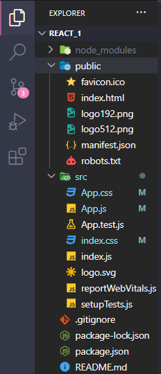
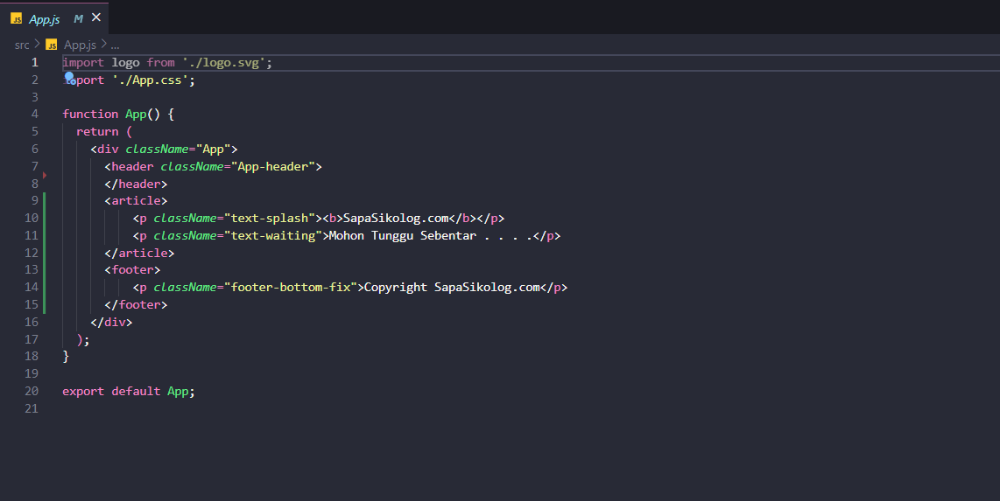
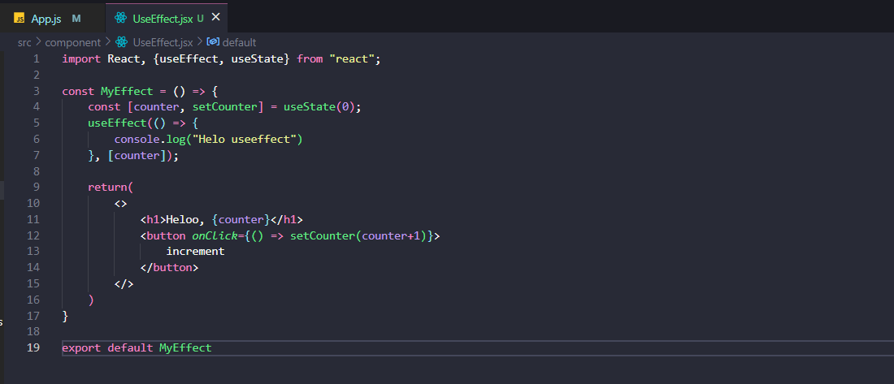
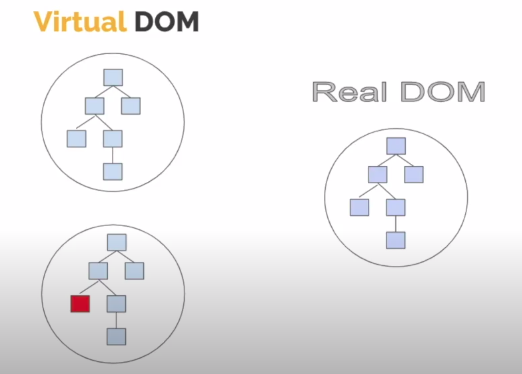

# WEEKLY REPORT , TUGAS WRITING WEEK 6

# React Js Dasar

## Pengertian React JS
    React JS adalah library JavaScript yang biasa digunakan saat membangun UI suatu website atau aplikasi web.
    Jadi, React JS bisa dianggap seperti perpustakaan yang berisi berbagai kode JavaScript yang sudah tertulis (pre-written). 
    Anda tinggal mengambil kode yang ingin Anda gunakan. Sehingga, ini membuat proses coding menjadi lebih efisien dengan framework JavaScript tersebut.

    Keuntungan menggunakan React JS adalah proses membuat aplikasi front-end leboh cepat walaupun menghandle berbagai data. 
    Konsep modular dalam Javascript juga diterapkan dalam react js. React JS membagi 1 tampilan pada website menjadi komponen komponen kecil


## Instalasi React JS
* Install Node Js (Recomended Version)
* Menggunakan library react
    ```javascript
        //ketikkan kode berikut pada git bash
        
        npm create-react-app My-app

        //npm disini otomatis terinstall ketika kita menginstall node js

        //ketika berhasil menginstall akan ada teks Happy Hacking 
    ``` 
* Kemudian running program dengan
    ```javascript
    npm start
    ```

* Dan ketikkan  
    ```javascript
    code . 
    // untuk membuka code editor (visual studio)
    ```
* React siap digunakan


## Struktur Project React JS
Karena React JS membagi 1 tampilan pada website menjadi komponen komponen kecil, berikut tampilan project react js yang berhasil diinstal.




Dan dibawah ini contoh struktur kode dari _App.js_





    Dengan membuat file berekstensi .jsx kita dapat menyisipkan tag html didalam return function, 
    semua tag html berlaku dan dapat digunakan secara normal tanpa menggunakan HTML DOM, tanpa menggunakan GetElementById/GetElementByClassName. 
    Rendering file JSX pada browser akan dicompile terlebih dahulu menjadi file JS.

Ada beberapa aturan dalam penulisan file JSX
* Setiap file JSX hanya boleh memiliki 1 root element / parent, file JSX tidak memperbolehkan adanya 2 root element dalam function.
    ``` javascript
        import './App.css';
        import MyComponent from './component/prop-type';


        function App() {
            return (
                <> 
                    <MyComponent/>
                </>
                );
            } // berikut struktur function yang diperbolehkan dalam file JSX

        export default App;
    ```

    ``` javascript
        import './App.css';
        import MyComponent from './component/prop-type';


        function App() {
            return (
                <div> // ----> parent 1
                    <MyComponent/> 
                <div/>
                <div> // ----> parent 2
                    <h1>Hello World<h1/> 
                <div/>
                );
            } // berikut adalah contoh function yang dapat menyebabkan error karena terdapat 2 parent / 2 root element

        export default App;
    ```
## Virtual DOM
    React JS memiliki fitur Virtual DOM, Virtual DOM secara singkat nya adalah sebuah javascript object (virtual) yang merepresentasikan DOM yang sebenarnya (real DOM). karena virtual dom ini adalah representasi dari real dom maka virtual dom adalah sebuah replikasi (copy) dari real dom tersebut. Berbeda konsep dengan DOM, virtual dom ini memiliki konsep yaitu setiap saat perubahan terjadi di state pada aplikasi kita maka akan membuat virtual dom yang baru (cloning).

Berikut gambaran dari Virtual DOM



## Class & ClassName

    Class adalah kata kunci dalam JavaScript dan JSX adalah ekstensi dari javascript. Itulah alasan utama mengapa React menggunakan className dari pada class.

Berikut contoh ClassName

``` javascript
    import PropTypes from "prop-types";

    const MyComponent = () => {
    return (
        <>
            <h1 className ='title'>Hello</h1>
            <p></p>
        </>
        );
    };
    
    MyComponent.propTypes = {
        name: PropTypes.string,
        status: PropTypes.oneOf(["created", "verified", "finised"]),
        };
    
    export default MyComponent;

```

## Variable
Akses variable dalam JSX menggunakan curly braces / {}

``` javascript
    import PropTypes from "prop-types";

    const MyComponent = ({ name, status }) => {
    return (
        <>
            <h1>Hello {"budi"}</h1>
            <p>Status :{"online"}</p>
        </>
        );
    };
    
    MyComponent.propTypes = {
        name: PropTypes.string,
        status: PropTypes.oneOf(["created", "verified", "finised"]),
        };
    
    export default MyComponent;

```

## Event 
Event di JSX tidak jauh beda dengan event yang ada didalam javascript, pendeklarasian event menggunakan curly braces / bracket {}

``` javascript
    import React, {useEffect, useState} from "react";

    const MyEffect = () => {
        const [counter, setCounter] = useState(0);
        useEffect(() => {
            console.log("Helo useeffect")
            }, [counter]);

    return(
        <>
            <h1>Heloo, {counter}</h1>
            <button onClick={() => setCounter(counter+1)}>
                increment
            </button>
        </>
    )
}

export default MyEffect
```

## Conditional rendering

```javascript

```

